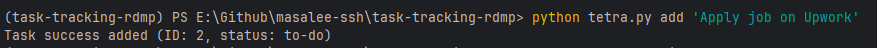
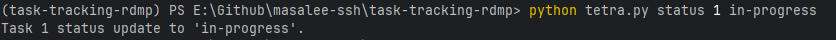
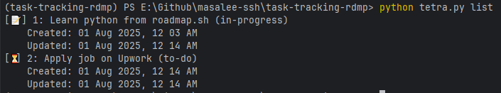

# Task Tracker CLI | Roadmap.sh
A simple command-line task tracker built in Python to help you manage to-dos with status update, timesteps, and 
persistent storage. 

---

## 🪁 Features
- Add tasks with a unique ID and status
- Update task status ('to-do', 'in-progress', 'done')
- Track when tasks are created and last updated
- View all tasks with timesteps and status icon
- Data saved in a JSON file ('task-tracker.json') - no last tasks
- Friendly command-line interface using 'argparse'

---

## 🔧 Requirments
- Python 3.6 or Higher

No external libraries needed - built with standard Python modules.

---

## 🛠 Installation
 ```bash
git clone https://github.com/masalee-dev/task-tracking-rdmp.git
 ```

---

## ✅ Usage

### Add Task
 ```bash
pyhton tetra.py add 'Add your task'
 ```

### List All Tasks
```bash
python tetra.py list
```

### Update Task Status
```bash
python tetra.py status 2 in-progress
python tetra.py status 2 done
```

### Delete Task
```bash
python tetra.py delete 2
```

## 💻 Example Output 

#### Add Task


#### Update Status


#### List Tasks


## 🚀 Future Ideas (Contributors Welcome!)

- Filters task by status or date
- Add due dates or priorities
- Export tasks to CSV file
- GUI or web version using Flask or Thinker

## 🐱‍🚀 Author

### Haeder Ali

**[GitHub](https://github.com/Masalee-hub)**    
**[LinkedIn](https://www.linkedin.com/in/haederali/)**

## Project source
This is a project source from [roadmap.sh](https://roadmap.sh/projects/task-tracker)
